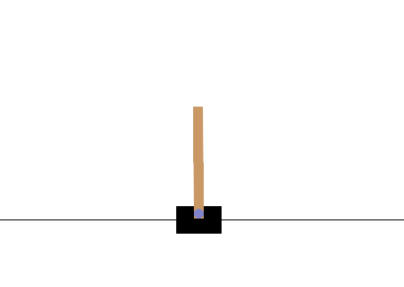

# CartPole-v1

<p align="center">
  
</p>


## Import

```
import gymnasium as gym
import numpy as np
import torch
import torch.nn as nn
import torch.optim as optim
import matplotlib.pyplot as plt
```

- gymnasium: ...
- numpy: ...
- torch: ...
  - nn: ...
  - optim: ...
- matplotlib.pyplot: ...

## Create environment

```
env = gym.make('CartPole-v1')
```
